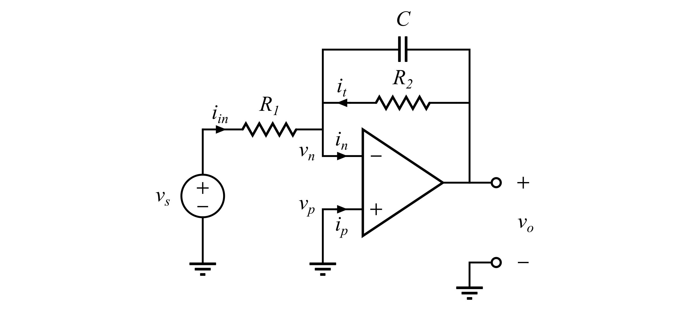

# Electrical Symbol Library

This library provides public domain vectorized electrical symbols for making publication-quality circuit diagrams. It aims to cover the most common analog and digital symbols from ANSI and IEC standards.

## Getting Started

Download the latest version of the library from the [Releases](https://github.com/basverdoes/ElectricalSymbolLibrary/releases) page, and open it in [Inkscape](https://inkscape.org/). Press `#` to enable grid lines. Look for the following buttons in the top-right corner.

  

Click the left button to enable snapping. Click the right button, go to *advanced mode*, and check the boxes for *Bounding boxes* and *Grids*.

## Drawing Guidelines

- Wire nodes should be grid-aligned.
- Wires should have a width of 0.7 px, and their corners should be sharp (not rounded).
- The fonts Times New Roman (6 pt) or Linux Libertine (6 pt) are recommended for annotations.
- Component reference designators are italicized, and (symbols of) physical quantities use the regular font style.

## License
The individual symbols, which are found in the `src/symbols/` directory, are licensed under the [CC0 1.0 Universal](https://creativecommons.org/publicdomain/zero/1.0/) license. All other files in this repository are licensed under the [CC BY-NC-SA 4.0](https://creativecommons.org/licenses/by-nc-sa/4.0/) license.